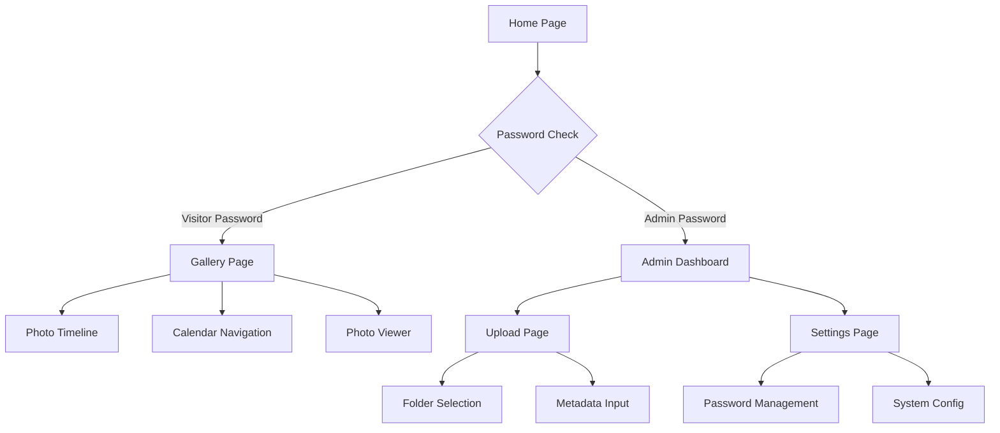

## 1. Product Overview
基于Cloudflare R2的无服务器照片管理网站，支持照片上传、分类管理和时间线浏览。为个人和小型团队提供简单易用的照片存储和展示解决方案。

解决传统照片管理复杂、成本高的痛点，通过GitHub Pages + Cloudflare R2实现零服务器部署，降低技术门槛。

## 2. Core Features

### 2.1 User Roles
| Role | Registration Method | Core Permissions |
|------|---------------------|------------------|
| Visitor | 输入访问密码 | 查看照片、浏览时间线 |
| Admin | 输入管理员密码 | 上传照片、编辑信息、管理设置 |

### 2.2 Feature Module
核心功能页面：
1. **Gallery Page**: 时间线展示、日历导航、照片查看器
2. **Upload Page**: 拖拽上传、文件夹管理、元数据编辑
3. **Settings Page**: 密码管理、系统配置

### 2.3 Page Details
| Page Name | Module Name | Feature description |
|-----------|-------------|---------------------|
| Gallery Page | Timeline View | 按拍摄日期倒序展示照片，支持无限滚动加载 |
| Gallery Page | Calendar Sidebar | 月视图日历，点击日期自动定位到对应照片 |
| Gallery Page | Photo Viewer | 支持缩放、旋转、全屏模式，键盘快捷键操作 |
| Gallery Page | Folder Navigation | 树形结构展示文件夹，支持切换不同相册 |
| Upload Page | Drag & Drop Zone | 支持多文件拖拽上传，显示上传进度 |
| Upload Page | Folder Manager | 创建新文件夹，选择现有文件夹分类 |
| Upload Page | Metadata Editor | 填写拍摄日期（自动填充当前日期）和描述信息 |
| Upload Page | Batch Operations | 批量设置文件夹、日期和描述 |
| Settings Page | Password Management | 设置访问密码和管理员密码，支持修改 |
| Settings Page | System Config | 配置网站标题、每页显示数量等基础设置 |

## 3. Core Process

**访客流程**：
1. 访问网站首页，输入访问密码
2. 浏览照片时间线，使用日历快速定位
3. 点击照片查看大图，支持缩放旋转

**管理员流程**：
1. 输入管理员密码登录
2. 创建文件夹分类，批量上传照片
3. 编辑照片元数据，调整拍摄日期和描述
4. 管理系统设置，修改密码和配置

## 4. User Interface Design

### 4.1 Design Style
- **主色调**: 深灰色 (#1f2937) + 蓝色强调色 (#3b82f6)
- **按钮风格**: 圆角矩形，悬停效果，主要操作为实心蓝色按钮
- **字体**: Inter 字体族，标题 24-32px，正文 14-16px
- **布局风格**: 卡片式布局，左侧内容区域，右侧日历边栏
- **图标风格**: Lucide React 线性图标，简洁现代

### 4.2 Page Design Overview
| Page Name | Module Name | UI Elements |
|-----------|-------------|-------------|
| Gallery Page | Timeline Container | 响应式网格布局，卡片间距 16px，悬停阴影效果 |
| Gallery Page | Calendar Sidebar | 固定宽度 280px，月视图日历，当前日期高亮显示 |
| Gallery Page | Photo Card | 圆角图片容器，底部显示拍摄日期和描述文字 |
| Upload Page | Drop Zone | 虚线边框区域，拖拽时高亮，显示上传进度条 |
| Upload Page | Metadata Form | 两栏表单布局，日期选择器，文本输入框 |
| Settings Page | Config Panel | 分组卡片布局，密码强度指示器，保存按钮 |

### 4.3 Responsiveness
桌面端优先设计，支持平板和手机自适应：
- 桌面端：三栏布局（导航 + 内容 + 日历）
- 平板端：两栏布局（导航 + 内容/日历切换）
- 手机端：单栏布局，底部标签页切换

触摸优化：增大点击区域，支持手势操作（捏合缩放、滑动切换）