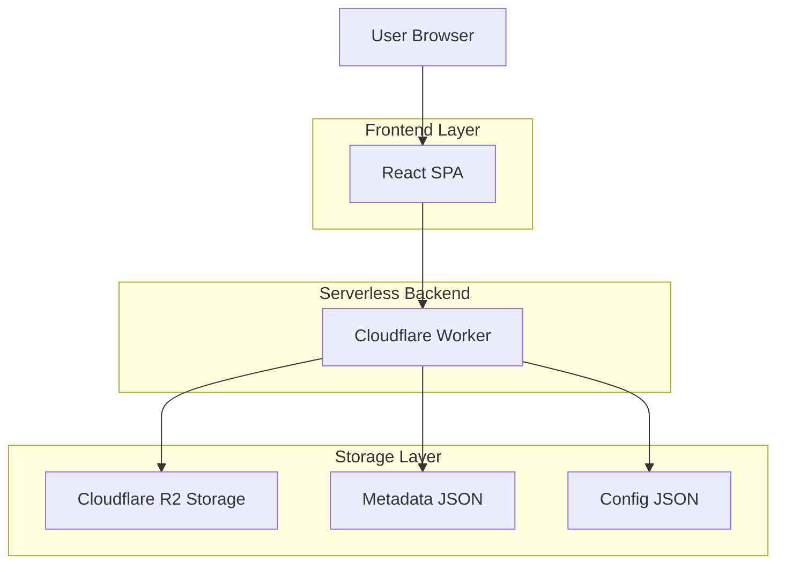
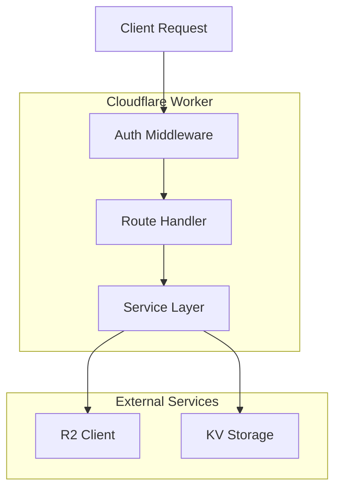

## 1. Architecture design



## 2. Technology Description

- **Frontend**: React@18 + TypeScript + Vite
- **Styling**: TailwindCSS@3 + HeadlessUI
- **State Management**: React Context + Local Storage
- **Initialization Tool**: vite-init
- **Backend**: Cloudflare Worker (Serverless)
- **Storage**: Cloudflare R2 Object Storage
- **Key Libraries**: 
  - react-photo-view (图片查看器)
  - date-fns (日期处理)
  - lucide-react (图标)
  - react-dropzone (拖拽上传)

## 3. Route definitions

| Route | Purpose | Access Control |
|-------|---------|----------------|
| / | 登录页面，密码验证 | 公开访问 |
| /gallery | 照片画廊主页面 | 需要访问令牌 |
| /upload | 照片上传页面 | 需要管理员令牌 |
| /settings | 系统设置页面 | 需要管理员令牌 |
| /folder/:id | 指定文件夹视图 | 需要访问令牌 |

## 4. API definitions

### 4.1 Authentication API

**Login**
```
POST /api/auth/login
```

Request:
| Param Name | Param Type | isRequired | Description |
|------------|------------|------------|-------------|
| password | string | true | 用户输入的密码 |
| role | string | true | 角色：visitor 或 admin |

Response:
| Param Name | Param Type | Description |
|------------|------------|-------------|
| token | string | JWT访问令牌 |
| role | string | 用户角色 |
| expires | number | 过期时间戳 |

### 4.2 Data Management API

**Get Metadata**
```
GET /api/data?folder=:folderId
```

Headers:
```
Authorization: Bearer ${token}
```

Response:
```json
{
  "photos": [
    {
      "id": "uuid",
      "url": "https://r2.example.com/photo.jpg",
      "thumbnail": "https://r2.example.com/thumb_photo.jpg",
      "date": "2024-01-15",
      "description": "照片描述",
      "folder": "folder-id",
      "uploadedAt": "2024-01-20T10:30:00Z"
    }
  ],
  "folders": [
    {
      "id": "folder-id",
      "name": "旅行照片",
      "createdAt": "2024-01-01T00:00:00Z"
    }
  ]
}
```

**Update Metadata**
```
POST /api/data
```

Headers:
```
Authorization: Bearer ${adminToken}
```

Request:
| Param Name | Param Type | Description |
|------------|------------|-------------|
| action | string | 操作类型：add, update, delete |
| data | object | 操作数据 |

### 4.3 Upload API

**Get Presigned URL**
```
POST /api/upload-url
```

Headers:
```
Authorization: Bearer ${adminToken}
```

Request:
| Param Name | Param Type | Description |
|------------|------------|-------------|
| filename | string | 原始文件名 |
| folder | string | 目标文件夹ID |

Response:
| Param Name | Param Type | Description |
|------------|------------|-------------|
| uploadUrl | string | 预签名上传URL |
| photoId | string | 照片唯一ID |
| publicUrl | string | 公开访问URL |

## 5. Server architecture diagram



## 6. Data model

### 6.1 Data Structure Definition

**Config Structure (config.json)**
```json
{
  "siteTitle": "我的照片集",
  "visitorPassword": "hashed_password",
  "adminPassword": "hashed_password",
  "itemsPerPage": 50,
  "enableUpload": true,
  "createdAt": "2024-01-01T00:00:00Z"
}
```

**Metadata Structure (metadata.json)**
```json
{
  "version": "1.0",
  "lastUpdated": "2024-01-20T10:30:00Z",
  "photos": [
    {
      "id": "photo-uuid",
      "filename": "IMG_2024.jpg",
      "originalName": "IMG_2024.jpg",
      "size": 2048576,
      "mimeType": "image/jpeg",
      "url": "https://r2.example.com/photos/IMG_2024.jpg",
      "thumbnailUrl": "https://r2.example.com/thumbnails/IMG_2024_thumb.jpg",
      "date": "2024-01-15",
      "description": "北京故宫拍摄",
      "folder": "travel-2024",
      "width": 4000,
      "height": 3000,
      "uploadedAt": "2024-01-20T10:30:00Z",
      "uploadedBy": "admin"
    }
  ],
  "folders": [
    {
      "id": "folder-uuid",
      "name": "2024旅行",
      "parent": "root",
      "createdAt": "2024-01-01T00:00:00Z",
      "photoCount": 25
    }
  ]
}
```

### 6.2 Security Design

**密码安全**
- 使用 bcrypt 进行密码哈希
- JWT 令牌包含角色信息和过期时间
- 支持令牌刷新机制

**存储安全**
- R2 bucket 配置为公开读取（优化性能）
- 元数据通过 Worker 代理访问，不直接暴露
- 文件名使用 UUID 避免猜测

**访问控制**
- 访客只能读取元数据和查看照片
- 管理员拥有完整操作权限
- API 端点根据角色进行权限验证